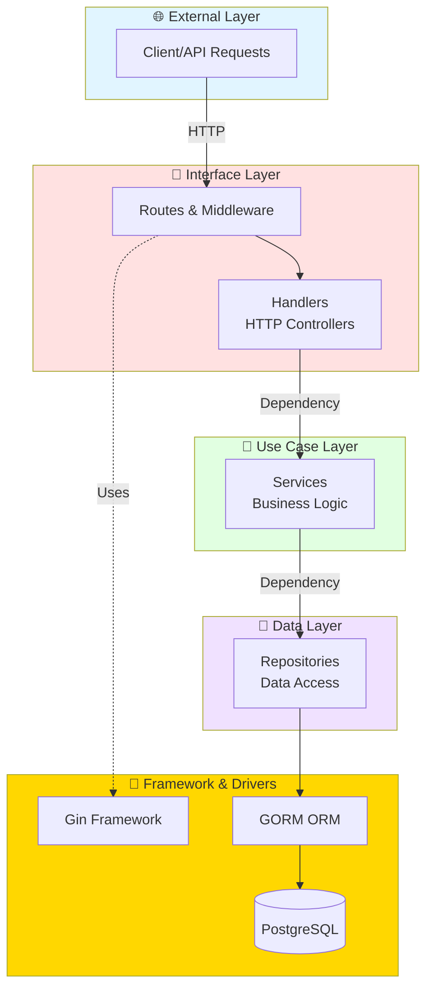
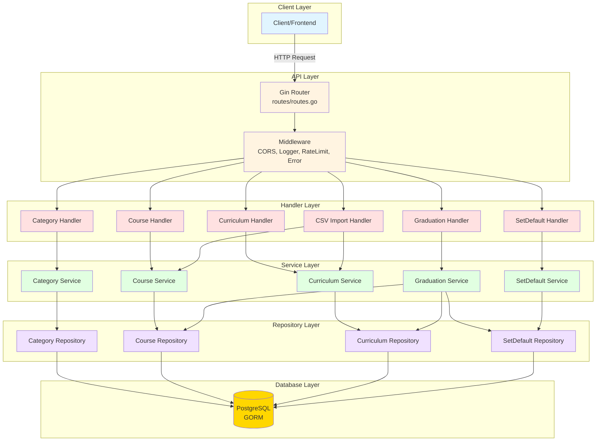
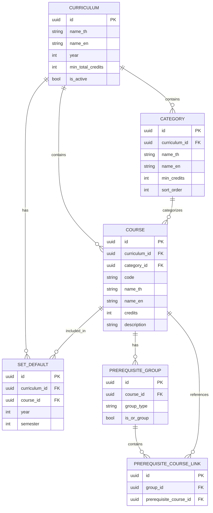
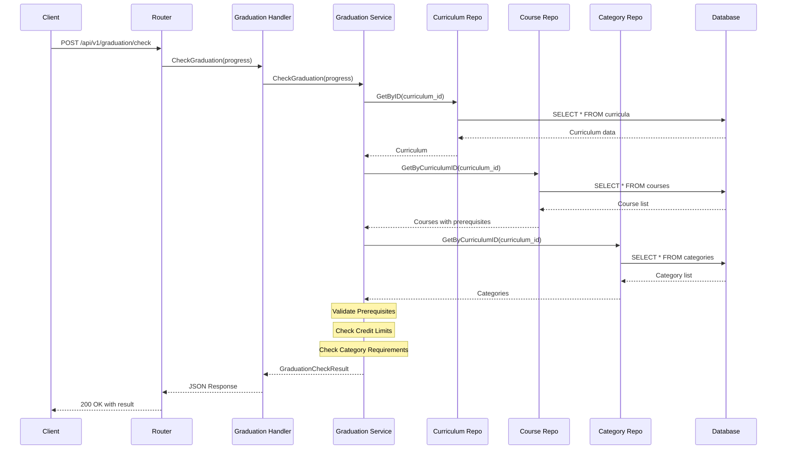
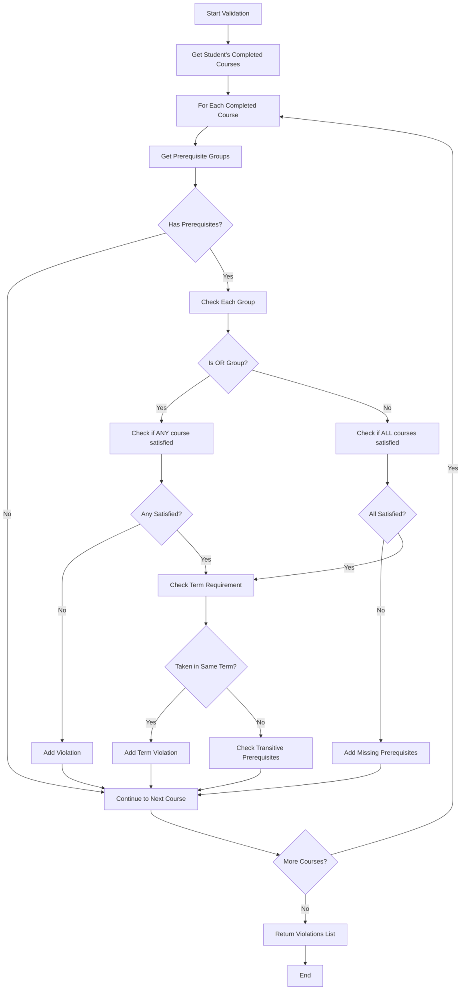
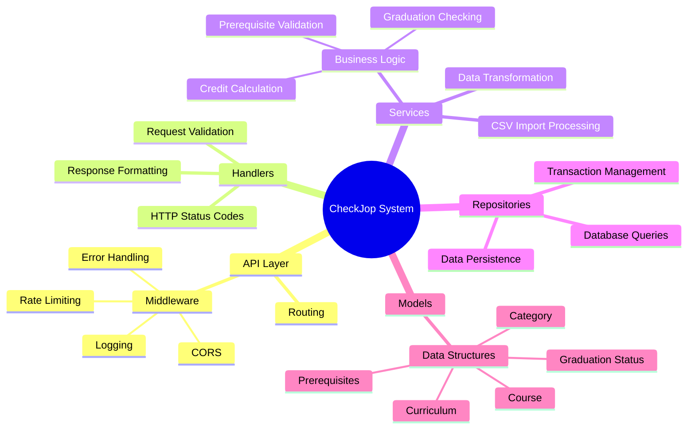
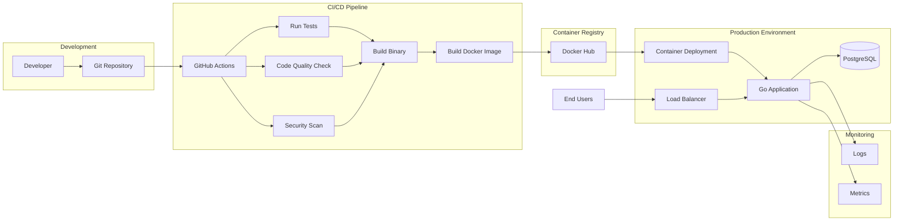
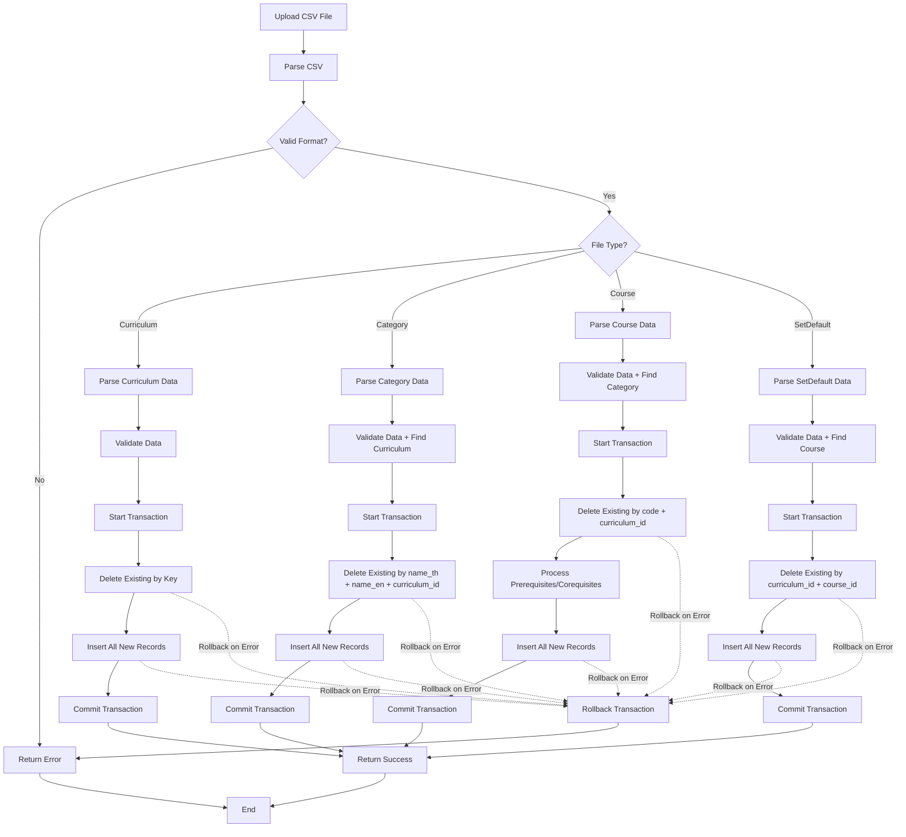
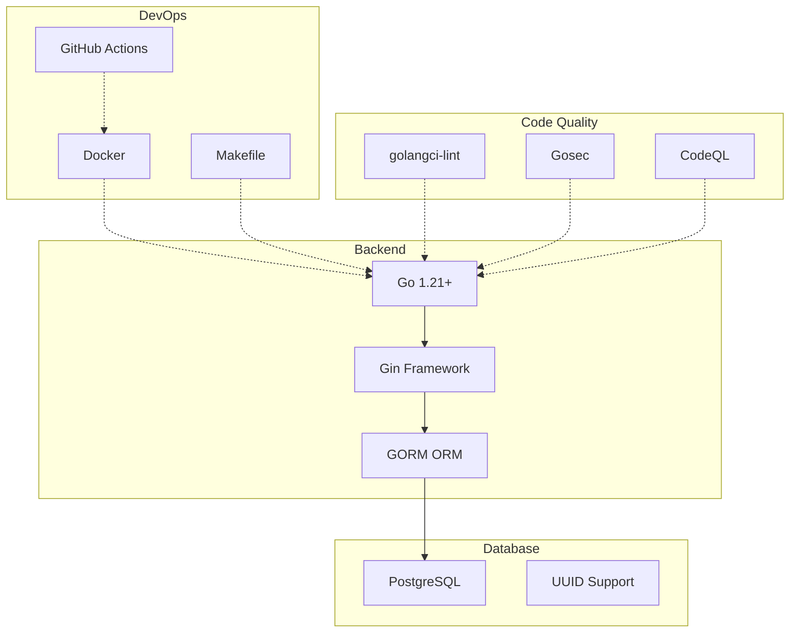

# CheckJop Backend - System Overview

## 🏗️ 1. System Architecture

### Clean Architecture Overview

**Dependency Rule:** แต่ละ layer ขึ้นกับ layer ด้านในเท่านั้น (Inner layers ไม่รู้จัก outer layers)

### Detailed Architecture

## Data Model Relationships

## API Flow - Graduation Check Example

## Business Logic Flow - Prerequisite Validation

## Component Responsibilities

## Deployment Architecture

## CSV Import Flow

**หมายเหตุ:** ใช้ Delete-then-Insert pattern ภายใน Transaction (ไม่ใช่ drop table)
- Category: ลบที่มี name_th, name_en, curriculum_id เหมือนกัน แล้ว insert ใหม่
- Course: ลบที่มี code, curriculum_id เหมือนกัน แล้ว insert ใหม่พร้อม relationships
- SetDefault: ลบที่มี curriculum_id, course_id เหมือนกัน แล้ว insert ใหม่
- มี rollback เมื่อเกิด error ระหว่าง transaction

## Key Features

### 1. Curriculum Management
- สร้าง/แก้ไข/ลบหลักสูตร
- Import หลักสูตรจาก CSV
- Query หลักสูตรตามปี/ชื่อ

### 2. Course Management
- จัดการรายวิชาในหลักสูตร
- กำหนด Prerequisites (OR/AND groups)
- กำหนด Corequisites
- Support Transitive Prerequisites

### 3. Graduation Checking
- ตรวจสอบเงื่อนไขการจบ
- Validate Prerequisites/Corequisites
- Check Credit Limits (ปกติ 22, ฤดูร้อน 10)
- Check Category Requirements

### 4. Set Default
- กำหนดแผนการเรียนมาตรฐาน
- ระบุปี/เทอมที่แนะนำ

### 5. CSV Import
- Import ข้อมูลจาก CSV files
- Bulk upsert operations
- Transaction support

## Technology Stack

