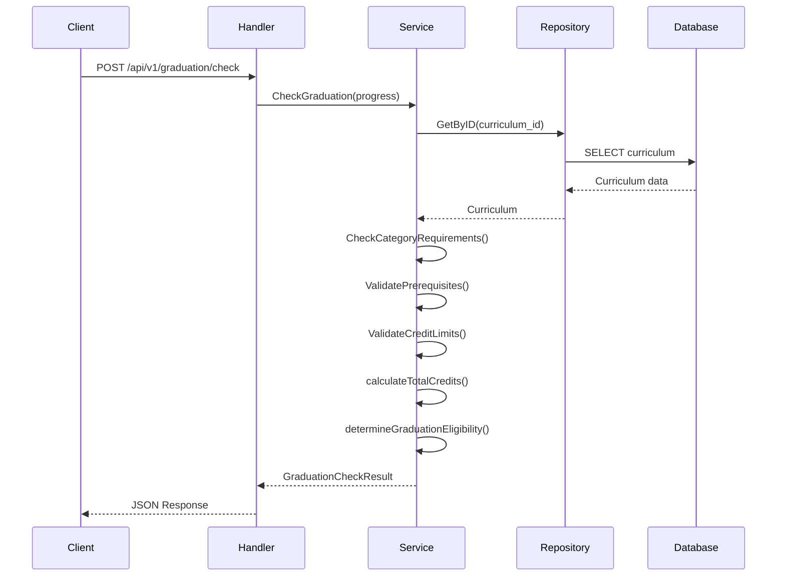
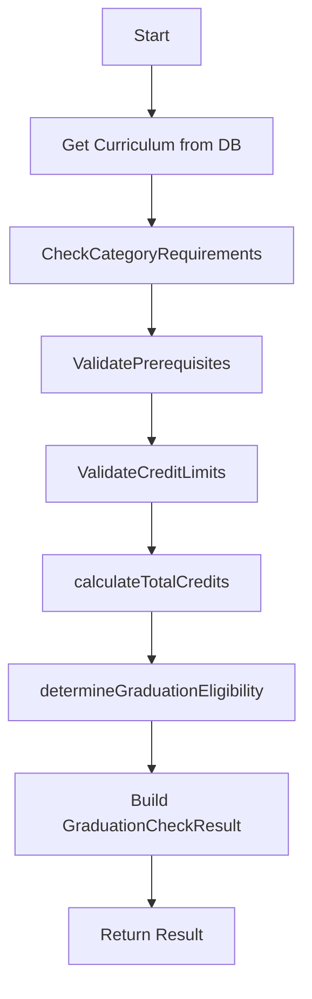
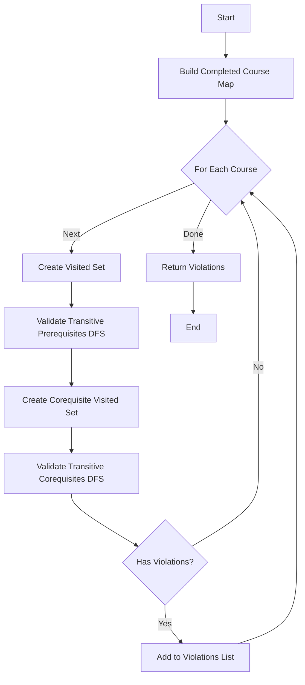
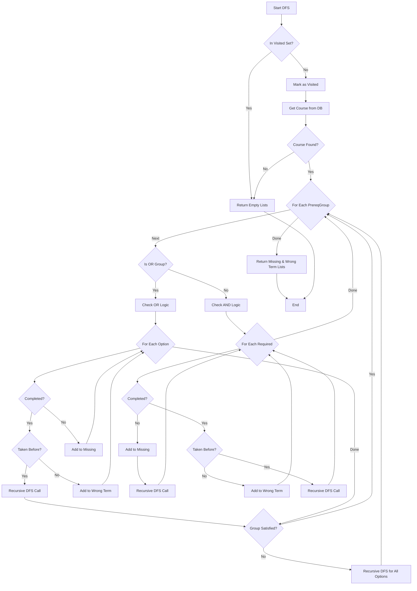

# Graduation Check Logic Analysis
## API Endpoint: `/api/v1/graduation/check`

---

## 📋 Table of Contents
1. [Overall Flow](#overall-flow)
2. [Main Function: CheckGraduation](#main-function-checkgraduation)
3. [Sub-Functions Analysis](#sub-functions-analysis)
4. [Data Structures Used](#data-structures-used)
5. [Algorithms & Techniques](#algorithms--techniques)
6. [Detailed Function Breakdown](#detailed-function-breakdown)

---

## Overall Flow



---

## Main Function: CheckGraduation

### 🎯 เป้าหมาย
ตรวจสอบว่านักศึกษาสามารถจบการศึกษาได้หรือไม่ โดยตรวจสอบ 4 เงื่อนไขหลัก

### 📊 Input
```go
type StudentProgress struct {
    CurriculumID  uuid.UUID         // หลักสูตรที่เรียน
    Courses       []CompletedCourse // รายวิชาที่ลงเรียนแล้ว
    ManualCredits map[string]int    // หน่วยกิตที่ระบุเอง (optional)
}
```

### 📤 Output
```go
type GraduationCheckResult struct {
    CanGraduate            bool                       // สามารถจบได้หรือไม่
    TotalCredits           int                        // หน่วยกิตรวม
    RequiredCredits        int                        // หน่วยกิตที่ต้องการ
    CategoryResults        []CategoryCheckResult      // ผลการตรวจสอบแต่ละหมวด
    MissingCourses         []string                   // วิชาที่ขาด
    PrerequisiteViolations []PrerequisiteViolation    // การละเมิด prerequisite
    CreditLimitViolations  []CreditLimitViolation     // การละเมิดจำนวนหน่วยกิต
}
```

### 🔄 ขั้นตอนการทำงาน
1. **ดึงข้อมูลหลักสูตร** จาก database
2. **เรียก CheckCategoryRequirements()** - ตรวจสอบหน่วยกิตแต่ละหมวด
3. **เรียก ValidatePrerequisites()** - ตรวจสอบ prerequisite และ corequisite
4. **เรียก ValidateCreditLimits()** - ตรวจสอบจำนวนหน่วยกิตต่อเทอม
5. **คำนวณหน่วยกิตรวม** ด้วย calculateTotalCredits()
6. **ตัดสินว่าจบได้หรือไม่** ด้วย determineGraduationEligibility()

---

## Sub-Functions Analysis

### 1. CheckCategoryRequirements()

#### 🎯 เป้าหมาย
ตรวจสอบว่านักศึกษาได้หน่วยกิตครบในแต่ละหมวดวิชาหรือไม่

#### 🧮 Algorithm
**Linear Search + Aggregation**

#### 📦 Data Structures
- **HashMap (map[string]CompletedCourse)** - เก็บรายวิชาที่ลงแล้ว (O(1) lookup)
- **Array/Slice** - เก็บผลลัพธ์แต่ละหมวด

#### 🔄 ขั้นตอนการทำงาน
```
FOR each category in curriculum:
    earnedCredits = 0
    
    // วิธีที่ 1: ตรวจจาก CategoryName ใน input
    FOR each completed course:
        IF course.CategoryName == category name:
            earnedCredits += course.Credits
    
    // วิธีที่ 2: ตรวจจาก database ถ้าวิธีที่ 1 ไม่มี
    IF earnedCredits == 0:
        FOR each course in category.Courses:
            IF course.Code exists in completedCourseMap:
                earnedCredits += course.Credits
    
    // วิธีที่ 3: ใช้ manual credits ถ้ายังไม่มี
    IF earnedCredits == 0 AND manualCredits exists:
        earnedCredits = manualCredits[category.Name]
    
    // เก็บผลลัพธ์
    results.append({
        CategoryName: category.NameTH,
        EarnedCredits: earnedCredits,
        RequiredCredits: category.MinCredits,
        IsSatisfied: earnedCredits >= category.MinCredits
    })

RETURN results
```

#### ⏱️ Time Complexity
- **Best case**: O(C × S) - C = จำนวน categories, S = จำนวนวิชาที่ลง
- **Worst case**: O(C × (S + D)) - D = จำนวนวิชาใน database

---

### 2. ValidatePrerequisites()

#### 🎯 เป้าหมาย
ตรวจสอบว่าแต่ละวิชาที่ลงมีการลง prerequisite และ corequisite ครบถ้วนถูกต้องหรือไม่

#### 🧮 Algorithm
**Depth-First Search (DFS) with Visited Set**

#### 📦 Data Structures
- **HashMap (map[string]CompletedCourse)** - เก็บรายวิชาที่ลงแล้ว
- **HashMap (map[string]bool)** - visited set สำหรับป้องกัน infinite loop
- **Array/Slice** - เก็บ violations
- **Graph (Implicit)** - prerequisite relationships เป็น directed graph

#### 🔄 ขั้นตอนการทำงาน
```
buildCompletedCourseMap(courses) -> map[courseCode]CompletedCourse

FOR each completed course:
    visited = new Set()
    
    // ตรวจ Prerequisites แบบ transitive
    missingPrereqs, prereqsWrongTerm = 
        validateTransitivePrerequisites(
            courseCode, 
            completedMap, 
            currentCourse, 
            visited
        )
    
    // ตรวจ Corequisites แบบ transitive
    coreqVisited = new Set()
    missingCoreqs, coreqsWrongTerm = 
        validateTransitiveCorequisites(
            courseCode, 
            completedMap, 
            currentCourse, 
            coreqVisited
        )
    
    IF has any violations:
        violations.append({
            CourseCode: courseCode,
            MissingPrereqs: missingPrereqs,
            PrereqsTakenInWrongTerm: prereqsWrongTerm,
            MissingCoreqs: missingCoreqs,
            CoreqsTakenInWrongTerm: coreqsWrongTerm
        })

RETURN violations
```

#### ⏱️ Time Complexity
- **O(S × (G + E))** 
  - S = จำนวนวิชาที่ลง
  - G = จำนวน nodes ใน prerequisite graph
  - E = จำนวน edges ใน prerequisite graph
  - เป็น DFS traversal แบบมี visited set

---

### 3. validateTransitivePrerequisites() - ฟังก์ชันสำคัญที่สุด!

#### 🎯 เป้าหมาย
ตรวจสอบ prerequisite แบบ transitive (ข้ามชั้น) พร้อม support OR/AND logic

#### 🧮 Algorithm
**Recursive Depth-First Search (DFS) with Memoization**

#### 📦 Data Structures
- **Graph (Directed Acyclic Graph - DAG)** - prerequisite relationships
- **HashMap** - visited set (memoization)
- **Array/Slice** - เก็บ missing และ wrong term courses

#### 🌲 Graph Structure
```
Course A
  └─ PrerequisiteGroup 1 (OR Group)
      ├─ Course B
      │   └─ PrerequisiteGroup 1 (AND Group)
      │       ├─ Course D
      │       └─ Course E
      └─ Course C
```

#### 🔄 ขั้นตอนการทำงาน (Recursive DFS)
```
FUNCTION validateTransitivePrerequisites(courseCode, completedMap, currentCourse, visited):
    // Base case: หยุดถ้าเคยเยี่ยมแล้ว (ป้องกัน infinite loop)
    IF courseCode in visited:
        RETURN [], []
    
    visited[courseCode] = true
    
    // ดึงข้อมูลวิชาจาก database
    course = getCourseByCode(courseCode)
    IF course not found:
        RETURN [], []
    
    allMissing = []
    allWrongTerm = []
    
    // วนลูปตรวจแต่ละ PrerequisiteGroup
    FOR each group in course.PrerequisiteGroups:
        
        IF group.IsOrGroup:  // OR Logic
            groupSatisfied = false
            groupMissing = []
            groupWrongTerm = []
            
            FOR each prereqCourse in group.PrerequisiteCourses:
                prereqCode = prereqCourse.Code
                
                IF prereqCode exists in completedMap:
                    completed = completedMap[prereqCode]
                    
                    IF isCourseTakenBefore(completed, currentCourse):
                        groupSatisfied = true
                        
                        // Recursive call: ตรวจ prerequisite ของ prereq นี้ต่อ
                        transitMissing, transitWrongTerm = 
                            validateTransitivePrerequisites(
                                prereqCode, 
                                completedMap, 
                                currentCourse, 
                                visited
                            )
                        
                        allMissing += transitMissing
                        allWrongTerm += transitWrongTerm
                        BREAK  // OR satisfied, stop checking
                    ELSE:
                        groupWrongTerm.append(prereqCode)
                ELSE:
                    groupMissing.append(prereqCode)
            
            IF NOT groupSatisfied:
                // OR group ไม่ผ่าน: รวมทุก option ที่ขาด
                allMissing += groupMissing
                allWrongTerm += groupWrongTerm
                
                // ตรวจ transitive prerequisites ของทุก option
                FOR each prereqCourse in group.PrerequisiteCourses:
                    transitMissing, transitWrongTerm = 
                        validateTransitivePrerequisites(...)
                    allMissing += transitMissing
                    allWrongTerm += transitWrongTerm
        
        ELSE:  // AND Logic
            FOR each prereqCourse in group.PrerequisiteCourses:
                prereqCode = prereqCourse.Code
                
                IF prereqCode NOT in completedMap:
                    allMissing.append(prereqCode)
                    
                    // Recursive: ตรวจ prerequisite ของตัวที่ขาดด้วย
                    transitMissing, transitWrongTerm = 
                        validateTransitivePrerequisites(...)
                    allMissing += transitMissing
                    allWrongTerm += transitWrongTerm
                
                ELSE IF NOT isCourseTakenBefore(completed, currentCourse):
                    allWrongTerm.append(prereqCode)
                
                ELSE:
                    // Satisfied: ตรวจ transitive prerequisites ต่อ
                    transitMissing, transitWrongTerm = 
                        validateTransitivePrerequisites(...)
                    allMissing += transitMissing
                    allWrongTerm += transitWrongTerm
    
    RETURN allMissing, allWrongTerm
```

#### 🌟 Key Features
1. **Transitive (ข้ามชั้น)**: ตรวจสอบ prerequisite ของ prerequisite ต่อไปเรื่อย ๆ
2. **OR Logic**: ลงวิชาใดวิชาหนึ่งใน group ก็ผ่าน
3. **AND Logic**: ต้องลงทุกวิชาใน group
4. **Cycle Detection**: ใช้ visited set ป้องกัน infinite loop
5. **Strict Term Requirement**: ตรวจว่าลง prerequisite ก่อนหรือไม่

#### ⏱️ Time Complexity
- **O(V + E)** - V = nodes, E = edges
- เป็น DFS traversal แบบมี memoization (visited set)
- Worst case คือ traverse ทุก node และ edge หนึ่งครั้ง

---

### 4. validateTransitiveCorequisites()

#### 🎯 เป้าหมาย
ตรวจสอบ corequisite แบบ transitive (ข้ามชั้น) พร้อม support OR/AND logic

#### 🧮 Algorithm
**Recursive DFS** (เหมือน validateTransitivePrerequisites แต่เช็คเทอมต่างกัน)

#### 📦 Data Structures
เหมือน validateTransitivePrerequisites

#### 🔄 ความแตกต่างจาก Prerequisite
```go
// Prerequisite: ต้องลงก่อน
isCourseTakenBefore(completed, currentCourse)
// เช็คว่า: year1 < year2 หรือ (year เท่ากัน และ semester1 < semester2)

// Corequisite: ต้องลงเทอมเดียวกัน
isSameTerm(completed, currentCourse)
// เช็คว่า: year1 == year2 และ semester1 == semester2
```

#### ⏱️ Time Complexity
- **O(V + E)** - เหมือน validateTransitivePrerequisites

---

### 5. ValidateCreditLimits()

#### 🎯 เป้าหมาย
ตรวจสอบว่าแต่ละเทอมลงเกินจำนวนหน่วยกิตที่อนุญาตหรือไม่

#### 🧮 Algorithm
**Grouping + Aggregation**

#### 📦 Data Structures
- **HashMap (map[string]int)** - key = "year-semester", value = total credits

#### 🔄 ขั้นตอนการทำงาน
```
termCredits = new HashMap<string, int>()

// Group และ Sum
FOR each course in progress.Courses:
    termKey = format("%d-%d", course.Year, course.Semester)
    termCredits[termKey] += course.Credits

violations = []

// Validate แต่ละเทอม
FOR each (termKey, credits) in termCredits:
    parse year, semester from termKey
    
    IF semester == 3:  // ฤดูร้อน
        maxCredits = 10
    ELSE:              // เทอมปกติ
        maxCredits = 22
    
    IF credits > maxCredits:
        violations.append({
            Year: year,
            Semester: semester,
            Credits: credits,
            MaxCredits: maxCredits
        })

RETURN violations
```

#### ⏱️ Time Complexity
- **O(S)** - S = จำนวนวิชาที่ลง
- Linear scan เพื่อ group และ validate

---

### 6. Helper Functions

#### buildCompletedCourseMap()
```go
// Purpose: แปลง array เป็น HashMap สำหรับ O(1) lookup
// Input: []CompletedCourse
// Output: map[courseCode]CompletedCourse
// Time: O(n)
```

#### calculateTotalCredits()
```go
// Purpose: รวมหน่วยกิตทั้งหมด
// Algorithm: Simple aggregation
// Time: O(n)
```

#### determineGraduationEligibility()
```go
// Purpose: ตัดสินว่าจบได้หรือไม่
// Logic:
//   - totalCredits >= requiredCredits
//   - AND all categories satisfied
//   - AND no prerequisite violations
//   - AND no credit limit violations
// Time: O(C) - C = จำนวน categories
```

#### isSameTerm()
```go
// Purpose: เช็คว่า 2 วิชาอยู่เทอมเดียวกันหรือไม่
// Time: O(1)
```

#### isCourseTakenBefore()
```go
// Purpose: เช็คว่าวิชาที่ 1 ลงก่อนวิชาที่ 2 หรือไม่
// Time: O(1)
```

---

## Data Structures Used

### 1. HashMap (Go's map)
**ใช้ใน:**
- `buildCompletedCourseMap()` - เก็บวิชาที่ลงแล้ว
- `visited` set ใน DFS - ป้องกัน cycle
- `termCredits` - group วิชาตามเทอม

**ข้อดี:**
- O(1) average case lookup
- O(1) insertion
- เหมาะสำหรับ frequent lookups

### 2. Array/Slice
**ใช้ใน:**
- เก็บ violations
- เก็บ results
- เก็บ missing courses

**ข้อดี:**
- Sequential access
- Easy iteration
- Dynamic sizing

### 3. Graph (Implicit/Logical)
**ใช้ใน:**
- Prerequisite relationships
- Corequisite relationships

**โครงสร้าง:**
```go
Course {
    PrerequisiteGroups []PrerequisiteGroup
    CorequisiteGroups  []PrerequisiteGroup
}

PrerequisiteGroup {
    IsOrGroup           bool
    PrerequisiteCourses []PrerequisiteCourseLink
}

PrerequisiteCourseLink {
    PrerequisiteCourse Course
}
```

**Graph Properties:**
- Directed Acyclic Graph (DAG) - ไม่มี cycle (ในทางทฤษฎี)
- Multi-edge support - OR/AND groups
- Weighted edges - ไม่มี weight

---

## Algorithms & Techniques

### 1. Depth-First Search (DFS)
**ใช้ใน:** `validateTransitivePrerequisites()` และ `validateTransitiveCorequisites()`

**Why DFS?**
- เหมาะสำหรับตรวจสอบ path ใน graph
- สามารถตรวจสอบแบบ transitive (ข้ามชั้น) ได้
- ใช้ recursion ทำให้โค้ดอ่านง่าย

**DFS Properties:**
- **Time:** O(V + E)
- **Space:** O(V) สำหรับ recursion stack และ visited set

### 2. Memoization (Visited Set)
**ใช้ใน:** DFS functions

**Why Memoization?**
- ป้องกัน infinite loop จาก circular dependencies
- หลีกเลี่ยงการตรวจสอบ node เดียวกันซ้ำ
- ลด time complexity

### 3. Aggregation
**ใช้ใน:** `calculateTotalCredits()`, `CheckCategoryRequirements()`, `ValidateCreditLimits()`

**Why Aggregation?**
- รวมข้อมูลหลาย records
- สรุปผลลัพธ์

### 4. Linear Search
**ใช้ใน:** `CheckCategoryRequirements()`

**Why Linear Search?**
- ต้องตรวจทุก category
- ไม่สามารถ optimize ด้วย binary search ได้

### 5. Grouping
**ใช้ใน:** `ValidateCreditLimits()`

**Why Grouping?**
- จัดกลุ่มวิชาตามเทอม
- ง่ายต่อการ aggregate และ validate

---

## Detailed Function Breakdown

### CheckGraduation() - Main Orchestrator



**Orchestration Pattern:**
- รวบรวมผลจากหลาย sub-functions
- ไม่มี complex logic เอง
- Focus on composition

---

### ValidatePrerequisites() - Core Validation Logic



---

### validateTransitivePrerequisites() - DFS Traversal



**Key Insights:**
1. **Recursive DFS** - เรียกตัวเองเพื่อตรวจ prerequisite ของ prerequisite
2. **OR Logic** - Break early เมื่อพบ option ที่ satisfy
3. **AND Logic** - ต้องตรวจทุกตัว
4. **Cycle Detection** - ใช้ visited set
5. **Accumulation** - รวม violations จาก recursive calls

---

## Performance Analysis

### Best Case Scenarios
1. **No Prerequisites** - O(S) เฉพาะ linear scan
2. **All Satisfied** - O(S) ไม่ต้อง recursive
3. **Shallow Graph** - O(S × D) D = depth

### Worst Case Scenarios
1. **Deep Transitive Chain** - O(S × V × E)
2. **Many OR Groups** - ต้องตรวจทุก option
3. **Complex Graph** - มี branching factor สูง

### Space Complexity
- **HashMap**: O(S) สำหรับ completed courses
- **Visited Set**: O(V) สำหรับแต่ละ DFS
- **Recursion Stack**: O(D) D = max depth

---

## Summary

### ✅ Strengths
1. **Comprehensive** - ครอบคลุมทุกเงื่อนไข
2. **Transitive** - ตรวจข้ามชั้นได้
3. **Flexible** - support OR/AND logic
4. **Safe** - ป้องกัน infinite loop

### ⚠️ Potential Issues
1. **Performance** - อาจช้าถ้า graph ใหญ่มาก
2. **Memory** - recursive อาจใช้ stack เยอะ
3. **Duplicate Checks** - อาจตรวจ node เดียวกันหลายครั้งใน OR groups

### 🚀 Possible Optimizations
1. **Caching** - cache ผลลัพธ์ DFS
2. **Iterative DFS** - แทน recursive เพื่อลด stack
3. **Early Termination** - หยุดเร็วถ้าพบ violation
4. **Parallel Processing** - ตรวจหลายวิชาพร้อมกัน
