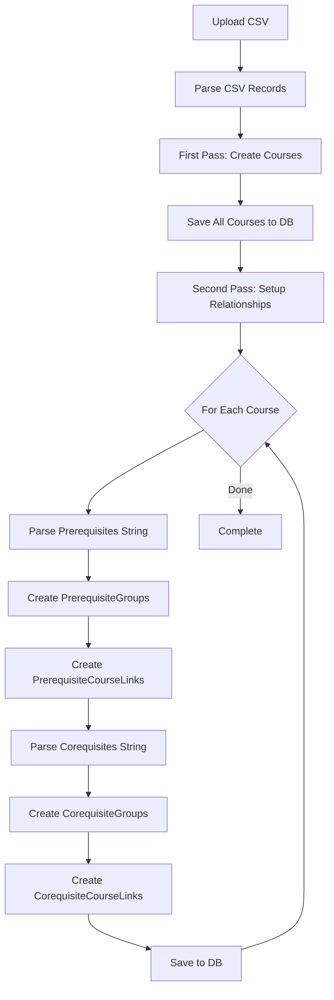
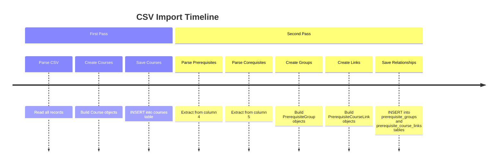

# การสร้าง PrerequisiteGroup และ PrerequisiteCourseLink

## 📋 ภาพรวม

เมื่อ import course จาก CSV ระบบจะสร้าง `PrerequisiteGroup` และ `PrerequisiteCourseLink` ในขั้นตอนที่ 2 (Second Pass) หลังจากสร้าง Course แล้ว

---

## 🔄 ขั้นตอนการ Import Course จาก CSV



---

## 📝 ตัวอย่างจาก CSV

### Example 1: Simple Prerequisite (AND Group)

```csv
code,courseNameEN,courseNameTH,credit,prerequisites,corequisites,category,curriculum,Year
2301108,Calculus II,แคลคูลัส 2,3,2301107,,วิชาแกน,"เอกเดี่ยว-ฝึกงาน-2566",66
```

**การสร้าง:**

#### 1. First Pass: สร้าง Course
```go
Course {
    ID: uuid-of-2301108
    Code: "2301108"
    NameEN: "Calculus II"
    NameTH: "แคลคูลัส 2"
    Credits: 3
    CurriculumID: uuid-of-เอกเดี่ยว-ฝึกงาน-2566
    CategoryID: uuid-of-วิชาแกน
}
```

#### 2. Second Pass: สร้าง PrerequisiteGroup และ Link

**Parse Prerequisites String:** `"2301107"`
- เป็น single course (ไม่มี OR)
- สร้าง AND group (IsOrGroup = false)

```go
// สร้าง PrerequisiteGroup
PrerequisiteGroup {
    ID: auto-generated-uuid-1
    CourseID: uuid-of-2301108
    GroupType: "prerequisite"
    IsOrGroup: false  // AND group
}

// สร้าง PrerequisiteCourseLink
PrerequisiteCourseLink {
    ID: auto-generated-uuid-2
    GroupID: auto-generated-uuid-1
    PrerequisiteCourseID: uuid-of-2301107
}
```

**โครงสร้าง Database:**
```
Course (2301108)
  └─ PrerequisiteGroup (AND)
      └─ PrerequisiteCourseLink
          └─ Points to: Course (2301107)
```

---

### Example 2: Multiple Prerequisites (AND Group)

```csv
code,courseNameEN,courseNameTH,credit,prerequisites,corequisites,category,curriculum,Year
2301371,OS,ระบบปฏิบัติการ,3,"2301265, 2301274",,วิชาเฉพาะด้าน,"เอกเดี่ยว-ฝึกงาน-2566",66
```

**Parse Prerequisites String:** `"2301265, 2301274"`
- มี comma แยก → AND group (ต้องลงทั้งสองวิชา)
- สร้าง 1 AND group มี 2 links

```go
// สร้าง 1 PrerequisiteGroup
PrerequisiteGroup {
    ID: auto-generated-uuid-1
    CourseID: uuid-of-2301371
    GroupType: "prerequisite"
    IsOrGroup: false  // AND group
}

// สร้าง 2 PrerequisiteCourseLinks
PrerequisiteCourseLink {
    ID: auto-generated-uuid-2
    GroupID: auto-generated-uuid-1
    PrerequisiteCourseID: uuid-of-2301265
}

PrerequisiteCourseLink {
    ID: auto-generated-uuid-3
    GroupID: auto-generated-uuid-1
    PrerequisiteCourseID: uuid-of-2301274
}
```

**โครงสร้าง Database:**
```
Course (2301371)
  └─ PrerequisiteGroup (AND)
      ├─ PrerequisiteCourseLink → Course (2301265)
      └─ PrerequisiteCourseLink → Course (2301274)
```

---

### Example 3: OR Prerequisites

```csv
code,courseNameEN,courseNameTH,credit,prerequisites,corequisites,category,curriculum,Year
2301180,Explore CS,เปิดโลกวิทยาการคอมพิวเตอร์,2,2301170 OR 2301173,,วิชาเฉพาะด้าน,"เอกเดี่ยว-ฝึกงาน-2566",66
```

**Parse Prerequisites String:** `"2301170 OR 2301173"`
- มี "OR" → OR group (ลงอันใดอันหนึ่งก็ผ่าน)
- สร้าง 1 OR group มี 2 links

```go
// สร้าง 1 PrerequisiteGroup
PrerequisiteGroup {
    ID: auto-generated-uuid-1
    CourseID: uuid-of-2301180
    GroupType: "prerequisite"
    IsOrGroup: true  // OR group
}

// สร้าง 2 PrerequisiteCourseLinks
PrerequisiteCourseLink {
    ID: auto-generated-uuid-2
    GroupID: auto-generated-uuid-1
    PrerequisiteCourseID: uuid-of-2301170
}

PrerequisiteCourseLink {
    ID: auto-generated-uuid-3
    GroupID: auto-generated-uuid-1
    PrerequisiteCourseID: uuid-of-2301173
}
```

**โครงสร้าง Database:**
```
Course (2301180)
  └─ PrerequisiteGroup (OR)
      ├─ PrerequisiteCourseLink → Course (2301170)
      └─ PrerequisiteCourseLink → Course (2301173)
```

---

### Example 4: Mixed OR and AND Groups

```csv
code,courseNameEN,courseNameTH,credit,prerequisites,corequisites,category,curriculum,Year
2301400,Advanced Course,วิชาขั้นสูง,3,"(2301265 OR 2301274), (2301279 OR 2301369)",,วิชาเฉพาะด้าน,"เอกเดี่ยว-ฝึกงาน-2566",66
```

**Parse Prerequisites String:** `"(2301265 OR 2301274), (2301279 OR 2301369)"`
- มี comma แยก 2 กลุ่ม → ต้องผ่านทั้ง 2 กลุ่ม (AND logic between groups)
- แต่ละกลุ่มภายในเป็น OR

```go
// สร้าง PrerequisiteGroup ที่ 1 (OR)
PrerequisiteGroup {
    ID: auto-generated-uuid-1
    CourseID: uuid-of-2301400
    GroupType: "prerequisite"
    IsOrGroup: true  // OR group
}

PrerequisiteCourseLink {
    ID: auto-generated-uuid-2
    GroupID: auto-generated-uuid-1
    PrerequisiteCourseID: uuid-of-2301265
}

PrerequisiteCourseLink {
    ID: auto-generated-uuid-3
    GroupID: auto-generated-uuid-1
    PrerequisiteCourseID: uuid-of-2301274
}

// สร้าง PrerequisiteGroup ที่ 2 (OR)
PrerequisiteGroup {
    ID: auto-generated-uuid-4
    CourseID: uuid-of-2301400
    GroupType: "prerequisite"
    IsOrGroup: true  // OR group
}

PrerequisiteCourseLink {
    ID: auto-generated-uuid-5
    GroupID: auto-generated-uuid-4
    PrerequisiteCourseID: uuid-of-2301279
}

PrerequisiteCourseLink {
    ID: auto-generated-uuid-6
    GroupID: auto-generated-uuid-4
    PrerequisiteCourseID: uuid-of-2301369
}
```

**โครงสร้าง Database:**
```
Course (2301400)
  ├─ PrerequisiteGroup 1 (OR)
  │   ├─ PrerequisiteCourseLink → Course (2301265)
  │   └─ PrerequisiteCourseLink → Course (2301274)
  └─ PrerequisiteGroup 2 (OR)
      ├─ PrerequisiteCourseLink → Course (2301279)
      └─ PrerequisiteCourseLink → Course (2301369)
```

**Validation Logic:**
- ต้องผ่าน Group 1: ลง 2301265 **หรือ** 2301274
- **และ** ต้องผ่าน Group 2: ลง 2301279 **หรือ** 2301369

---

### Example 5: Corequisite

```csv
code,courseNameEN,courseNameTH,credit,prerequisites,corequisites,category,curriculum,Year
2304181,Phy Lab,ปฏิบัติการฟิสิกส์พื้นฐาน,1,,2304121,วิชาพื้นฐานวิทยาศาสตร์,"เอกเดี่ยว-ฝึกงาน-2566",66
```

**Parse Corequisites String:** `"2304121"`
- เหมือน prerequisite แต่เป็น GroupType = "corequisite"

```go
// สร้าง PrerequisiteGroup (ใช้ struct เดียวกัน)
PrerequisiteGroup {
    ID: auto-generated-uuid-1
    CourseID: uuid-of-2304181
    GroupType: "corequisite"  // แตกต่างจาก prerequisite
    IsOrGroup: false  // AND group
}

// สร้าง PrerequisiteCourseLink
PrerequisiteCourseLink {
    ID: auto-generated-uuid-2
    GroupID: auto-generated-uuid-1
    PrerequisiteCourseID: uuid-of-2304121
}
```

**โครงสร้าง Database:**
```
Course (2304181)
  └─ CorequisiteGroup (AND)
      └─ PrerequisiteCourseLink → Course (2304121)
```

---

## 🔧 Code Flow ในการสร้าง

### 1. Import CSV (First Pass)

```go
// File: internal/service/course_service.go
func (s *courseService) ImportFromCSV(reader io.Reader) error {
    // Parse CSV
    records := parseCSV(reader)
    
    // First Pass: สร้าง Course objects
    for each record in records {
        course := Course{
            Code: record[0],
            NameEN: record[1],
            NameTH: record[2],
            Credits: record[3],
            // ... ไม่มี prerequisites/corequisites ยัง
        }
        courses = append(courses, course)
    }
    
    // Save courses to DB
    courseRepo.BulkUpsert(courses)
    
    // Second Pass: สร้าง relationships
    return setupCourseRelationships(records)
}
```

### 2. Setup Relationships (Second Pass)

```go
func (s *courseService) setupCourseRelationships(records [][]string) error {
    for each record in records {
        courseCode := record[0]
        prerequisitesStr := record[4]  // "2301265, 2301274"
        corequisitesStr := record[5]   // "2304121"
        
        // Parse prerequisites
        if prerequisitesStr != "" {
            // เรียก parsePrerequisiteString()
            parsedGroups := parsePrerequisiteString(prerequisitesStr)
            
            // สร้าง PrerequisiteGroup + Links
            for each parsedGroup {
                group := PrerequisiteGroup{
                    IsOrGroup: parsedGroup.IsOrGroup,
                    GroupType: "prerequisite"
                }
                
                for each courseCode in parsedGroup.CourseCodes {
                    link := PrerequisiteCourseLink{
                        PrerequisiteCourseID: findCourseID(courseCode)
                    }
                    group.PrerequisiteCourses.append(link)
                }
                
                prerequisiteGroups.append(group)
            }
        }
        
        // Parse corequisites (เหมือนกัน แต่ GroupType = "corequisite")
        if corequisitesStr != "" {
            // ... same logic
        }
        
        // Save to DB
        SetCourseRelationshipsWithGroups(courseID, prerequisiteGroups, corequisiteGroups)
    }
}
```

### 3. Parse Prerequisite String

```go
func (s *courseService) parsePrerequisiteString(prerequisiteStr string) ([]PrerequisiteGroup, error) {
    // "2301265, 2301274" → split by comma
    parts := splitByCommaOutsideParentheses(prerequisiteStr)
    
    var groups []PrerequisiteGroup
    
    for each part {
        if contains(part, "OR") {
            // "(2301265 OR 2301274)" → OR group
            courseCodes := extractCourseCodes(part)
            groups.append(PrerequisiteGroup{
                IsOrGroup: true,
                CourseCodes: courseCodes
            })
        } else {
            // "2301265" → AND group (single course)
            groups.append(PrerequisiteGroup{
                IsOrGroup: false,
                CourseCodes: [part]
            })
        }
    }
    
    return groups
}
```

### 4. Save to Database

```go
// File: internal/repository/course_repository.go
func (r *courseRepository) SetPrerequisiteGroups(courseID uuid.UUID, groups []PrerequisiteGroup) error {
    // Start transaction
    tx := db.Begin()
    
    // 1. Delete old groups
    tx.Where("course_id = ? AND group_type = ?", courseID, "prerequisite").
       Delete(&PrerequisiteGroup{})
    
    // 2. Create new groups with links
    for each group {
        group.CourseID = courseID
        group.GroupType = "prerequisite"
        
        // Save group
        tx.Create(&group)  // auto-generate ID
        
        // Save links
        for each link in group.PrerequisiteCourses {
            link.GroupID = group.ID
            tx.Create(&link)  // auto-generate ID
        }
    }
    
    tx.Commit()
}
```

---

## ⏰ Timeline สรุป



---

## 🎯 สรุป

### PrerequisiteGroup สร้างเมื่อไหร่?
**Second Pass** หลังจาก import courses เสร็จแล้ว เมื่อ:
1. Parse prerequisites/corequisites string จาก CSV
2. Detect OR/AND logic
3. Create group object with `IsOrGroup` flag

### PrerequisiteCourseLink สร้างเมื่อไหร่?
**พร้อมกับ PrerequisiteGroup** เพราะ:
1. แต่ละ group มี links ที่ point ไปยัง prerequisite courses
2. Links ถูก create และ associate กับ group ทันที
3. Save พร้อมกันใน transaction

### GroupType แตกต่างกันอย่างไร?
- `"prerequisite"` - ต้องลงก่อน (เทอมก่อนหน้า)
- `"corequisite"` - ต้องลงเทอมเดียวกัน

### IsOrGroup คืออะไร?
- `true` - OR logic (ลงอันใดอันหนึ่งก็ผ่าน)
- `false` - AND logic (ต้องลงทุกตัว)

### ทำไมใช้ 2 Pass?
1. **First Pass** - สร้าง course ก่อนเพื่อให้มี ID
2. **Second Pass** - ใช้ ID ที่ได้มา link กัน (foreign key)

---

## 📊 Database Schema Recap

```
courses
  ├─ id (PK)
  ├─ code
  ├─ name_th
  └─ ...

prerequisite_groups
  ├─ id (PK)
  ├─ course_id (FK → courses)
  ├─ group_type ("prerequisite" or "corequisite")
  └─ is_or_group (boolean)

prerequisite_course_links
  ├─ id (PK)
  ├─ group_id (FK → prerequisite_groups)
  └─ prerequisite_course_id (FK → courses)
```

**Relationships:**
```
Course 1 ──→ N PrerequisiteGroup
PrerequisiteGroup 1 ──→ N PrerequisiteCourseLink
PrerequisiteCourseLink N ──→ 1 Course (prerequisite)
```
